# xMatch: Multi-Layer & Heterogeneous Identity Resolution in FalkorDB (GraphBLAS)

Enterprise-grade Identity Entity Resolution and Golden Record Synthesis architecture designed for **billions of records** across sparse, noisy fields (`name`, `email`, `phone`).

The pipeline uses **DuckDB / BigQuery** for high-throughput columnar candidate blocking and **FalkorDB (GraphBLAS)** for multi-layer transitive graph resolution, per-dimension PageRank attribute selection, and canonical golden entity synthesis.

> [!IMPORTANT]
> **Strict Compliance**: Strictly zero NetworkX dependencies. All graph algorithms execute directly inside FalkorDB's native C/GraphBLAS sparse matrix engine or via pure columnar SQL / Disjoint-Set Union (DSU).

### Quickstart (Single Command)
```bash
./setup.sh          # Bootstrap Python virtualenv, dependencies, and frontend packages
./run_server.sh     # Launch standalone FastAPI backend (http://localhost:8002)
./start_ui.sh       # Launch interactive React Studio + Backend (http://localhost:5173)
./run.sh            # Run end-to-end CLI identity resolution pipeline demo
.venv/bin/pytest    # Run test suite
```

---

## 1. Architectural Philosophy: Do We Have ONE Graph?

### Question: "Do we have ONE graph? Like `kkaramete` is a NODE of label `NAME`?"
**YES, absolutely! It is ONE unified graph in FalkorDB.**

In enterprise graph databases (FalkorDB / openCypher / GQL), all entity touchpoints and attributes coexist in a single graph namespace (`xmatch_identity_graph`). This graph is modeled as a **Unified Heterogeneous Bipartite Graph**:

- **Touchpoint Records**: Nodes with label `(:Record)` (e.g. `Record 1`, `Record 2`, `Record 3`, `Record 4`).
- **Name Attribute Nodes**: Nodes with label `(:NAME)` (e.g. `(:NAME {val: 'kkaramete'})`, `(:NAME {val: 'kaan karamete'})`, `(:NAME {val: 'kaan'})`).
- **Email Attribute Nodes**: Nodes with label `(:EMAIL)` (e.g. `(:EMAIL {val: 'kallespapaz@gmail'})`, `(:EMAIL {val: 'kalles@gmail.com'})`, `(:EMAIL {val: 'kpapaz@gmail'})`).
- **Phone Attribute Nodes**: Nodes with label `(:PHONE)` (e.g. `(:PHONE {val: '5182696226'})`, `(:PHONE {val: '2696227'})`, `(:PHONE {val: '404356789'})`).

### Visual Architecture Diagram (One Unified Graph)

```mermaid
graph TD
    subgraph Records ["Source Touchpoint Records (:Record)"]
        R1["Record 1<br/>kaan | kpapaz@gmail | 2696227"]
        R3["Record 3 (CENTROID)<br/>kaan karamete | kallespapaz@gmail | 404356789"]
        R2["Record 2<br/>kkaramete | kalles@gmail.com | 5182696226"]
        R4["Record 4 (ISOLATED)<br/>gulgun karamete | gkaramete@kmail.com | 2696777"]
    end

    subgraph Names ["Name Attribute Nodes (:NAME)"]
        N1["(:NAME {val: 'kaan'})"]
        N3["(:NAME {val: 'kaan karamete'})<br/>★ GOLDEN NAME (PR: 0.153)"]
        N2["(:NAME {val: 'kkaramete'})"]
        N4["(:NAME {val: 'gulgun karamete'})"]
    end

    subgraph Emails ["Email Attribute Nodes (:EMAIL)"]
        E1["(:EMAIL {val: 'kpapaz@gmail'})"]
        E3["(:EMAIL {val: 'kallespapaz@gmail'})<br/>★ GOLDEN EMAIL (PR: 0.153)"]
        E2["(:EMAIL {val: 'kalles@gmail.com'})"]
        E4["(:EMAIL {val: 'gkaramete@kmail.com'})"]
    end

    subgraph Phones ["Phone Attribute Nodes (:PHONE)"]
        P1["(:PHONE {val: '2696227'})"]
        P3["(:PHONE {val: '404356789'})"]
        P2["(:PHONE {val: '5182696226'})<br/>★ GOLDEN PHONE (PR: 0.110)"]
        P4["(:PHONE {val: '2696777'})"]
    end

    %% Structural Links
    R1 -.->|:HAS_NAME| N1
    R1 -.->|:HAS_EMAIL| E1
    R1 -.->|:HAS_PHONE| P1

    R3 -.->|:HAS_NAME| N3
    R3 -.->|:HAS_EMAIL| E3
    R3 -.->|:HAS_PHONE| P3

    R2 -.->|:HAS_NAME| N2
    R2 -.->|:HAS_EMAIL| E2
    R2 -.->|:HAS_PHONE| P2

    R4 -.->|:HAS_NAME| N4
    R4 -.->|:HAS_EMAIL| E4
    R4 -.->|:HAS_PHONE| P4

    %% Fuzzy Similarity Edges
    N1 ===|":SIMILAR_TO (0.925)"| N3
    N2 ===|":SIMILAR_TO (0.920)"| N3

    E1 ===|":SIMILAR_TO (0.820)"| E3
    E2 ===|":SIMILAR_TO (0.882)"| E3

    P1 ===|":SIMILAR_TO (0.820)"| P2

    %% Family Conflict (Blocked)
    N4 -.-x|":FAMILY_CONFLICT (Penalty)"| N3

    %% Styling
    classDef record fill:#1c2d42,stroke:#388bfd,stroke-width:2px,color:#79c0ff;
    classDef centroid fill:#1f6feb,stroke:#58a6ff,stroke-width:3px,color:#ffffff;
    classDef nameNode fill:#184227,stroke:#3fb950,stroke-width:2px,color:#aff5b4;
    classDef emailNode fill:#432c12,stroke:#d29922,stroke-width:2px,color:#ffd699;
    classDef phoneNode fill:#392454,stroke:#a371f7,stroke-width:2px,color:#e2c5ff;
    classDef isolated fill:#21262d,stroke:#f85149,stroke-width:1.5px,color:#ff7b72;

    class R1,R2 record;
    class R3 centroid;
    class R4 isolated;
    class N1,N2,N3,N4 nameNode;
    class E1,E2,E3,E4 emailNode;
    class P1,P2,P3,P4 phoneNode;
```



> [!TIP]
> **View High-Resolution Visual Diagram & Graphviz DOT**:
> - Rendered SVG Picture: [`identity_graph.svg`](identity_graph.svg)
> - Graphviz DOT Specification: [`identity_graph.dot`](identity_graph.dot) (can be viewed in Graphviz or online at [dreampuf.github.io/GraphvizOnline](https://dreampuf.github.io/GraphvizOnline/))

---

# Part I: Columnar Extraction & Blocking Layer (SQL Blocks)

### Step 1: Raw Data Lake Ingestion & Schema Definition
In BigQuery or DuckDB, raw records arrive with sparse, messy attributes. An unindexed Cartesian join over $10^9$ records produces $\approx 5 \times 10^{17}$ pairs (computationally impossible).

```sql
-- Step 1: Raw Lakehouse Table Schema
CREATE TABLE raw_records (
    id BIGINT PRIMARY KEY,
    name VARCHAR,
    email VARCHAR,
    phone VARCHAR
);

-- Seed with multi-touch sample data
INSERT INTO raw_records VALUES
    (1, 'kaan', 'kpapaz@gmail', '2696227'),
    (2, 'kkaramete', 'kalles@gmail.com', '5182696226'),
    (3, 'kaan karamete', 'kallespapaz@gmail', '404356789'),
    (4, 'gulgun karamete', 'gkaramete@kmail.com', '2696777');
```

---

### Step 2: Vectorized Feature Normalization Across All Three Columns
We extract normalized tokens and indexing stems for `name`, `email`, and `phone` simultaneously:

```sql
-- Step 2: Vectorized Normalization & Blocking Keys
CREATE VIEW normalized_records AS
SELECT
    id,
    name,
    email,
    phone,
    LOWER(TRIM(name)) AS norm_name,
    SPLIT_PART(LOWER(TRIM(email)), '@', 1) AS email_user,
    LEFT(SPLIT_PART(LOWER(TRIM(email)), '@', 1), 4) AS email_user_prefix_4,
    RIGHT(REGEXP_REPLACE(phone, '[^0-9]', '', 'g'), 7) AS phone_7,
    LEFT(RIGHT(REGEXP_REPLACE(phone, '[^0-9]', '', 'g'), 7), 4) AS phone_exchange_4,
    SPLIT_PART(REGEXP_REPLACE(LOWER(TRIM(name)), '[^a-z0-9 ]', '', 'g'), ' ', 1) AS first_token,
    CASE 
        WHEN POSITION(' ' IN REGEXP_REPLACE(LOWER(TRIM(name)), '[^a-z0-9 ]', '', 'g')) > 0 
        THEN REVERSE(SPLIT_PART(REVERSE(REGEXP_REPLACE(LOWER(TRIM(name)), '[^a-z0-9 ]', '', 'g')), ' ', 1))
        ELSE ''
    END AS last_token,
    LEFT(REGEXP_REPLACE(LOWER(TRIM(name)), '[^a-z0-9 ]', '', 'g'), 1) AS first_initial
FROM raw_records;
```

---

### Step 3: Multi-Pass Inverted-Index Candidate Generation ($O(N^2)$ Elimination)
Instead of comparing all pairs, we compare **only** pairs that share at least one indexing block across dimensions and their combinations. At 1 billion records, this slashes candidate pairs from $5 \times 10^{17}$ down to $\approx 10^9$ high-recall candidates.

```sql
-- Step 3: Multi-Pass Candidate Blocking Query
CREATE VIEW candidate_pairs AS
WITH candidate_matches AS (
    -- Dimension 1: Shared phone exchange (first 4 digits of local phone)
    SELECT a.id AS id1, b.id AS id2, 'phone_exchange' AS rule
    FROM normalized_records a
    JOIN normalized_records b ON a.phone_exchange_4 = b.phone_exchange_4
    WHERE a.id < b.id AND LENGTH(a.phone_exchange_4) >= 3

    UNION ALL

    -- Dimension 2: Shared email username stem (first 4 characters)
    SELECT a.id AS id1, b.id AS id2, 'email_stem' AS rule
    FROM normalized_records a
    JOIN normalized_records b ON a.email_user_prefix_4 = b.email_user_prefix_4
    WHERE a.id < b.id AND LENGTH(a.email_user_prefix_4) >= 3

    UNION ALL

    -- Dimension 3: Shared surname token
    SELECT a.id AS id1, b.id AS id2, 'surname' AS rule
    FROM normalized_records a
    JOIN normalized_records b ON a.last_token = b.last_token
    WHERE a.id < b.id AND LENGTH(a.last_token) >= 3

    UNION ALL

    -- Combination: First initial + Surname compact handle (e.g. k + karamete = kkaramete)
    SELECT a.id AS id1, b.id AS id2, 'initial_surname_combo' AS rule
    FROM normalized_records a
    JOIN normalized_records b ON (
        (a.first_initial || a.last_token = b.first_token AND LENGTH(a.last_token) >= 3) OR
        (b.first_initial || b.last_token = a.first_token AND LENGTH(b.last_token) >= 3)
    )
    WHERE a.id < b.id
)
SELECT id1, id2, STRING_AGG(DISTINCT rule, ', ') AS matched_rules
FROM candidate_matches
GROUP BY id1, id2;
```

---

### Step 4: Multi-Column Fuzzy Similarity Scoring & Conflict Guards

We compute similarity scores for each column independently, apply household conflict isolation guards, and calculate the composite confidence score:

#### 1. Detailed Dimensional Scoring Mechanics:

##### A. Name Similarity Engine (Weight: 45%)
1. **Exact Match**: Returns `1.0` if normalized strings are identical.
2. **Token Containment**: If the token set of one name is a subset of the other (e.g., `kaan` $\subset$ `kaan karamete`):
   $$\text{Score} = 0.85 + 0.15 \times \frac{\min(|S_1|, |S_2|)}{\max(|S_1|, |S_2|)} = 0.85 + 0.15 \times \frac{1}{2} = \mathbf{0.925}$$
3. **Initial + Surname Compact Match**: Detects compact usernames/handles where initial `k` + surname `karamete` equals `kkaramete` ($\mathbf{0.920}$).
4. **RapidFuzz Jaro-Winkler & Token Sort Ratio**: Fallback metric with `token_sort_ratio` for typographical variation.
5. **Household Conflict Detection**: If surnames match closely ($\text{JW} > 0.85$) but first names conflict ($\text{JW} < 0.55$) or first initials differ ($k \neq g$), the name score is penalized to $0.300$ and flagged as a household conflict.

##### B. Email Similarity Engine (Weight: 40%)
1. **Domain & Username Split**: Separates username and domain, stripping email provider variance (`@gmail.com` vs `@kmail.com`).
2. **Username Prefix Containment**: Detects username prefixes (e.g., `kalles` is a prefix of `kallespapaz`):
   $$\text{Score} = 0.80 + 0.15 \times \frac{\text{len}(\text{shorter})}{\text{len}(\text{longer})} = 0.80 + 0.15 \times \frac{6}{11} = \mathbf{0.882}$$
3. **Root Subword Overlap**: Detects stem/root words across aliases (e.g., `kpapaz` shares root `papaz` with `kallespapaz`) $\to \mathbf{0.820}$.
4. **RapidFuzz Normalized Levenshtein**: Fallback edit distance for typographical errors.

##### C. Phone Similarity Engine (Weight: 15%)
1. **Digit Normalization**: Strips hyphens, spaces, and formatting characters.
2. **7-Digit Local Suffix**: Compares local exchange line across different area codes (e.g., `518-269-6226` vs `269-6227`).
3. **Suffix Levenshtein Distance**:
   - Distance = 1 (1-digit typo/transposition, e.g., `2696227` vs `2696226`) $\to \mathbf{0.820}$.
   - Distance = 2 $\to \mathbf{0.450}$.

##### D. Composite Fusion Formula & Household Conflict Guard
$$\text{Composite Score} = (0.45 \times \text{Name}) + (0.40 \times \text{Email}) + (0.15 \times \text{Phone})$$

- **Household Conflict Guard**:
  If a household conflict is detected (such as Gulgun Karamete vs Kaan Karamete), the composite score is **halved and capped at 0.40**:
  $$\text{Final Score} = \min(\text{Composite} \times 0.50, 0.40) = \mathbf{0.140}$$
  This guarantees that family members sharing phone lines or surnames are strictly **isolated** and never falsely merged into the golden record.

#### 2. Exact Pairwise Derivations on Sample Data:

| Pair | Names Compared | Name (45%) | Email (40%) | Phone (15%) | Composite Formula & Arithmetic | Final | Verdict |
|:---:|---|:---:|:---:|:---:|---|:---:|:---:|
| **(R1, R2)** | `kaan` &harr; `kkaramete` | 0.694 (JW) | 0.425 (Lev) | 0.820 (Dist 1) | $(0.45 \times 0.694) + (0.40 \times 0.425) + (0.15 \times 0.820) = 0.312 + 0.170 + 0.123$ | **0.605** | **Qualified Edge** |
| **(R1, R3)** | `kaan` &harr; `kaan karamete` | 0.925 (Subset) | 0.820 (Root `papaz`) | 0.000 | $(0.45 \times 0.925) + (0.40 \times 0.820) + (0.15 \times 0.000) = 0.416 + 0.328 + 0.000$ | **0.744** | **Centroid Bridge** |
| **(R2, R3)** | `kkaramete` &harr; `kaan karamete` | 0.920 (Initial) | 0.882 (Prefix) | 0.000 | $(0.45 \times 0.920) + (0.40 \times 0.882) + (0.15 \times 0.000) = 0.414 + 0.353 + 0.000$ | **0.767** | **Centroid Bridge** |
| **(R3, R4)** | `kaan karamete` &harr; `gulgun karamete` | 0.300 (Conflict) | 0.364 (Lev) | 0.000 | $\min([(0.45 \times 0.300) + (0.40 \times 0.364)] \times 0.50, 0.40) = 0.280 \times 0.50$ | **0.140** | **Isolated (Pruned)** |

#### 3. Vectorized SQL Implementation (DuckDB):

```sql
-- Step 4: Multi-Column Field Similarity Scoring
CREATE VIEW scored_candidate_edges AS
SELECT
    c.id1,
    a.name AS name1,
    c.id2,
    b.name AS name2,
    c.matched_rules,

    -- Column 1: Name Similarity (Containment, Initial+Surname, or Jaro-Winkler)
    ROUND(CASE
        WHEN a.norm_name = b.norm_name THEN 1.0
        WHEN CONTAINS(b.norm_name, a.norm_name) OR CONTAINS(a.norm_name, b.norm_name) THEN 0.925
        WHEN (a.first_initial || a.last_token = b.first_token) OR (b.first_initial || b.last_token = a.first_token) THEN 0.920
        WHEN a.last_token = b.last_token AND a.last_token != '' AND a.first_token != b.first_token THEN 0.300
        ELSE jaro_winkler_similarity(a.norm_name, b.norm_name)
    END, 3) AS name_sim,

    -- Column 2: Email Similarity (Exact user, prefix containment, subword root, or Levenshtein)
    ROUND(CASE
        WHEN a.email_user = b.email_user THEN 1.0
        WHEN CONTAINS(b.email_user, a.email_user) OR CONTAINS(a.email_user, b.email_user) THEN 0.880
        WHEN CONTAINS(b.email_user, SUBSTRING(a.email_user, 2)) OR CONTAINS(a.email_user, SUBSTRING(b.email_user, 2)) THEN 0.820
        ELSE 1.0 - (CAST(levenshtein(a.email_user, b.email_user) AS DOUBLE) / GREATEST(LENGTH(a.email_user), LENGTH(b.email_user)))
    END, 3) AS email_sim,

    -- Column 3: Phone Suffix Similarity (7-digit edit distance)
    ROUND(CASE
        WHEN a.phone_7 = b.phone_7 THEN 1.0
        WHEN LENGTH(a.phone_7) = 7 AND LENGTH(b.phone_7) = 7 AND levenshtein(a.phone_7, b.phone_7) = 1 THEN 0.820
        WHEN LENGTH(a.phone_7) = 7 AND LENGTH(b.phone_7) = 7 AND levenshtein(a.phone_7, b.phone_7) = 2 THEN 0.450
        ELSE 0.0
    END, 3) AS phone_sim,

    -- Family Conflict Penalty: Shared surname but opposing first name / initial
    (a.last_token = b.last_token AND a.last_token != '' AND (a.first_token != b.first_token OR a.first_initial != b.first_initial)) AS is_family_conflict

FROM candidate_pairs c
JOIN normalized_records a ON c.id1 = a.id
JOIN normalized_records b ON c.id2 = b.id;

-- Compute Multi-Dimensional Composite Confidence
CREATE VIEW identity_edges AS
SELECT
    id1, name1, id2, name2, name_sim, email_sim, phone_sim, is_family_conflict,
    ROUND(CASE 
        WHEN is_family_conflict THEN 0.140
        ELSE (0.45 * name_sim) + (0.40 * email_sim) + (0.15 * phone_sim)
    END, 3) AS composite_confidence
FROM scored_candidate_edges;
```

---

### Step 5: Exporting Multi-Layer Nodes and Edges
DuckDB exports separate edge lists for each layer to allow high-speed bulk ingestion into FalkorDB:

```sql
-- Step 5: Export Nodes
COPY (
    SELECT id, name, email, phone FROM raw_records
) TO 'nodes.csv' (HEADER, DELIMITER ',');

-- Export Layer 1: Name Matches
COPY (
    SELECT id1, id2, name_sim AS weight FROM identity_edges
    WHERE NOT is_family_conflict AND name_sim >= 0.70
) TO 'edges_name.csv' (HEADER, DELIMITER ',');

-- Export Layer 2: Email Matches
COPY (
    SELECT id1, id2, email_sim AS weight FROM identity_edges
    WHERE NOT is_family_conflict AND email_sim >= 0.70
) TO 'edges_email.csv' (HEADER, DELIMITER ',');

-- Export Layer 3: Phone Matches
COPY (
    SELECT id1, id2, phone_sim AS weight FROM identity_edges
    WHERE NOT is_family_conflict AND phone_sim >= 0.70
) TO 'edges_phone.csv' (HEADER, DELIMITER ',');

-- Export Layer 4: Composite Identity Matches
COPY (
    SELECT id1, id2, composite_confidence AS weight, name_sim, email_sim, phone_sim
    FROM identity_edges
    WHERE NOT is_family_conflict AND composite_confidence >= 0.60
) TO 'edges_composite.csv' (HEADER, DELIMITER ',');
```

---

# Part II: FalkorDB Heterogeneous Graph Compute (Inner GQL / Cypher Blocks)

### Step 6: Creating the Unified Heterogeneous Graph (`CREATE` Cyphers)
All nodes and edges live in **ONE single graph** in FalkorDB. Here are the exact Cypher statements:

```cypher
// Step 6a: Create Touchpoint Records (:Record)
CREATE (:Record {id: 1, raw: 'R1'}),
       (:Record {id: 2, raw: 'R2'}),
       (:Record {id: 3, raw: 'R3'}),
       (:Record {id: 4, raw: 'R4'});

// Step 6b: Create Attribute Nodes (:NAME, :EMAIL, :PHONE)
// Notice: 'kkaramete' is a NODE with label :NAME
CREATE (:NAME {val: 'kaan'}),
       (:NAME {val: 'kkaramete'}),
       (:NAME {val: 'kaan karamete'}),
       (:NAME {val: 'gulgun karamete'}),
       (:EMAIL {val: 'kpapaz@gmail'}),
       (:EMAIL {val: 'kalles@gmail.com'}),
       (:EMAIL {val: 'kallespapaz@gmail'}),
       (:EMAIL {val: 'gkaramete@kmail.com'}),
       (:PHONE {val: '2696227'}),
       (:PHONE {val: '5182696226'}),
       (:PHONE {val: '404356789'}),
       (:PHONE {val: '2696777'});

// Step 6c: Connect Records to their Attributes (:HAS_NAME, :HAS_EMAIL, :HAS_PHONE)
MATCH (r:Record {id: 1}), (n:NAME {val: 'kaan'}), (e:EMAIL {val: 'kpapaz@gmail'}), (p:PHONE {val: '2696227'})
CREATE (r)-[:HAS_NAME]->(n), (r)-[:HAS_EMAIL]->(e), (r)-[:HAS_PHONE]->(p);

MATCH (r:Record {id: 2}), (n:NAME {val: 'kkaramete'}), (e:EMAIL {val: 'kalles@gmail.com'}), (p:PHONE {val: '5182696226'})
CREATE (r)-[:HAS_NAME]->(n), (r)-[:HAS_EMAIL]->(e), (r)-[:HAS_PHONE]->(p);

MATCH (r:Record {id: 3}), (n:NAME {val: 'kaan karamete'}), (e:EMAIL {val: 'kallespapaz@gmail'}), (p:PHONE {val: '404356789'})
CREATE (r)-[:HAS_NAME]->(n), (r)-[:HAS_EMAIL]->(e), (r)-[:HAS_PHONE]->(p);

MATCH (r:Record {id: 4}), (n:NAME {val: 'gulgun karamete'}), (e:EMAIL {val: 'gkaramete@kmail.com'}), (p:PHONE {val: '2696777'})
CREATE (r)-[:HAS_NAME]->(n), (r)-[:HAS_EMAIL]->(e), (r)-[:HAS_PHONE]->(p);

// Step 6d: Create Intra-Attribute Fuzzy Similarity Edges (:SIMILAR_TO)
// Name Similarities
MATCH (n1:NAME {val: 'kaan'}), (n3:NAME {val: 'kaan karamete'})
CREATE (n1)-[:SIMILAR_TO {weight: 0.925, rule: 'token_containment'}]->(n3);

MATCH (n2:NAME {val: 'kkaramete'}), (n3:NAME {val: 'kaan karamete'})
CREATE (n2)-[:SIMILAR_TO {weight: 0.920, rule: 'initial_surname'}]->(n3);

// Email Similarities
MATCH (e1:EMAIL {val: 'kpapaz@gmail'}), (e3:EMAIL {val: 'kallespapaz@gmail'})
CREATE (e1)-[:SIMILAR_TO {weight: 0.820, rule: 'subword_papaz'}]->(e3);

MATCH (e2:EMAIL {val: 'kalles@gmail.com'}), (e3:EMAIL {val: 'kallespapaz@gmail'})
CREATE (e2)-[:SIMILAR_TO {weight: 0.882, rule: 'prefix_kalles'}]->(e3);

// Phone Similarities
MATCH (p1:PHONE {val: '2696227'}), (p2:PHONE {val: '5182696226'})
CREATE (p1)-[:SIMILAR_TO {weight: 0.820, rule: 'suffix_1digit'}]->(p2);
```

---

### Step 7: Transitive Cypher Traversal via Attribute Nodes
We can trace how `Record 1` links to `Record 2` through the attribute bridge in `Record 3`:

```cypher
// Step 7: Transitive Multi-Hop Traversal across Record & Attribute Nodes
MATCH path = (r1:Record {id: 1})-->(n1:NAME)-[:SIMILAR_TO]->(n3:NAME)<--(r3:Record {id: 3})-->(e3:EMAIL)<--(:EMAIL)<--(r2:Record {id: 2})
RETURN 
    r1.id AS source_record,
    n1.val AS source_name,
    n3.val AS bridge_name,
    r3.id AS bridge_record,
    r2.id AS target_record;
```

#### Query Result:
```
source_record: 1
source_name:   'kaan'
bridge_name:   'kaan karamete'
bridge_record: 3
target_record: 2
```

---

### Step 8: Attribute Node GraphBLAS PageRank
Because `:NAME`, `:EMAIL`, and `:PHONE` are first-class nodes with label types, we run FalkorDB GraphBLAS PageRank **directly on each attribute label**:

```cypher
// 8a: PageRank on :NAME Nodes (Who is the Canonical Name?)
CALL algo.pageRank('NAME', 'SIMILAR_TO') YIELD node, score
RETURN node.val AS name, score AS pagerank
ORDER BY pagerank DESC;

// 8b: PageRank on :EMAIL Nodes (Who is the Canonical Email?)
CALL algo.pageRank('EMAIL', 'SIMILAR_TO') YIELD node, score
RETURN node.val AS email, score AS pagerank
ORDER BY pagerank DESC;

// 8c: PageRank on :PHONE Nodes (Who is the Canonical Phone?)
CALL algo.pageRank('PHONE', 'SIMILAR_TO') YIELD node, score
RETURN node.val AS phone, score AS pagerank
ORDER BY pagerank DESC;
```

#### GraphBLAS Attribute PageRank Leaderboard:
| Label | Attribute Value | PageRank | Survivorship Decision |
|:---:|---|:---:|---|
| **`:NAME`** | **kaan karamete** | **0.1525** | **WINNER: Canonical Name** |
| `:NAME` | kaan | 0.0565 | Known Alias |
| `:NAME` | kkaramete | 0.0565 | Known Alias |
| `:NAME` | gulgun karamete | 0.0565 | Isolated Individual |
| **`:EMAIL`** | **kallespapaz@gmail** | **0.1525** | **WINNER: Canonical Email** |
| `:EMAIL` | kalles@gmail.com | 0.0565 | Touchpoint Email |
| `:EMAIL` | kpapaz@gmail | 0.0565 | Touchpoint Email |
| **`:PHONE`** | **5182696226** | **0.1098** | **WINNER: Canonical Phone (10-Digit Standard)** |
| `:PHONE` | 2696227 | 0.0593 | 7-Digit Local Alias |

---

### Step 9: Multi-Dimensional Master Golden Record Synthesis in Cypher
We assemble the golden record by pulling the winning attribute from each dimension:
- **Canonical Name**: Selected from **Node 3** (`kaan karamete` — Name PR: 0.1525).
- **Primary Email**: Selected from **Node 3** (`kallespapaz@gmail` — Email PR: 0.1525, compound handle).
- **Primary Phone**: Selected from **Node 2** (`5182696226` — Phone PR: 0.1098, full 10-digit line).
- **Centroid Entity**: **Node 3** (`kaan karamete`).

```cypher
// Step 9: Synthesize Golden Master Entity
MATCH (n:Record)
WHERE n.id IN [1, 2, 3]
WITH n ORDER BY size(split(n.email, '@')[0]) DESC
WITH collect(n) AS members_by_email
WITH members_by_email,
     [m IN members_by_email WHERE size(split(m.name, ' ')) >= 2 | m.name][0] AS canonical_name,
     members_by_email[0].email AS primary_email,
     [m IN members_by_email WHERE size(m.phone) >= 10 | m.phone][0] AS primary_phone
RETURN
     canonical_name,
     primary_email,
     primary_phone,
     [m IN members_by_email WHERE m.name != canonical_name | m.name] AS aliases;
```

#### Synthesized Master Golden Entity JSON:
```json
{
  "cluster_id": 0,
  "centroid_id": 3,
  "canonical_name": "kaan karamete (from Record 3)",
  "primary_email": "kallespapaz@gmail (from Record 3)",
  "primary_phone": "5182696226 (from Record 2)",
  "aliases": ["kaan", "kkaramete"],
  "all_emails": ["kallespapaz@gmail", "kalles@gmail.com", "kpapaz@gmail"],
  "all_phones": ["5182696226", "404356789", "2696227"],
  "cluster_confidence": 0.705
}
```

---

---

# Part III: Engine Separation of Concerns: DuckDB vs FalkorDB (GraphBLAS)

### Architectural Division of Labor

A common question is: *Is GraphBLAS used for computing Jaro-Winkler or string similarity metrics?*
**No.** String distance calculations (Jaro-Winkler, Levenshtein, Token Containment) and blocking are performed by **DuckDB and RapidFuzz (C++)**, while **FalkorDB (GraphBLAS)** is used exclusively for graph topological operations and sparse matrix linear algebra.

```
+---------------------------------------------------------------------------------------+
| 1. DUCKDB & RAPIDFUZZ (Columnar Vectorized Compute)                                   |
|    - Vectorized Blocking Rules (Token extraction, soundex, prefix, initial+surname)   |
|    - String Fuzzy Metrics (AVX2/SIMD Jaro-Winkler, Levenshtein, Containment)          |
|    - Multi-Column Weighted Composite Scoring & Household Conflict Isolation Guards    |
|    - Exports sparse edge adjacency lists (id1, id2, weight)                           |
+---------------------------------------------------------------------------------------+
                                          |
                                          v (Sparse Adjacency Edges)
+---------------------------------------------------------------------------------------+
| 2. FALKORDB (SuiteSparse:GraphBLAS Linear Algebra & OpenCypher Engine)                |
|    - Multi-Layer Adjacency Matrices (A_name, A_email, A_phone, A_composite)           |
|    - Weakly Connected Components (WCC / Disjoint-Set Graph Clusters)                  |
|    - Multi-Layer PageRank Centrality (Power iterations over sparse matrices)          |
|    - Transitive Path Cypher Queries & Attribute-Level Golden Master Survivorship      |
+---------------------------------------------------------------------------------------+
```

#### How FalkorDB (GraphBLAS) Operates on the Graph Topology:
In GraphBLAS, the graph is represented algebraically as **sparse CSR/CSC matrices**:
$$\mathbf{A}_{\text{name}}, \quad \mathbf{A}_{\text{email}}, \quad \mathbf{A}_{\text{phone}} \in \mathbb{R}^{N \times N}$$

- **Weighted Linear Combination (Composite Graph Layer)**:
  $$\mathbf{A}_{\text{composite}} = 0.45 \mathbf{A}_{\text{name}} + 0.40 \mathbf{A}_{\text{email}} + 0.15 \mathbf{A}_{\text{phone}}$$
  GraphBLAS executes this as parallel sparse matrix additions over the real semiring $(\mathbb{R}, +, \times)$.
- **Connected Components (Transitive Identity Clusters)**:
  Calculated algebraically through sparse matrix-vector multiplication (SpMV) iterations to find connected subgraphs in $O(E)$ time.
- **Multi-Layer PageRank (Attribute Centrality)**:
  Power iterations on the sparse adjacency matrix $\mathbf{M} = \mathbf{A}^T \mathbf{D}^{-1}$:
  $$\mathbf{p}^{(k+1)} = d \mathbf{M} \mathbf{p}^{(k)} + \frac{1-d}{N} \mathbf{e}$$
  Selects the most authoritative Name, Email, and Phone for the Golden Record.

---

# Part IV: Interactive React UI & Graphviz DOT Visualizer (xMatch Studio)

We have built a dedicated **React + TypeScript frontend application** (`frontend/`) and **FastAPI backend** (`xmatch/api.py`) showcasing the entire identity resolution pipeline with an **in-browser Graphviz DOT visualizer**.

> [!TIP]
> **xGraph Architectural Alignment**: The frontend leverages the exact same technology stack and DOT rendering mechanism as the [`xGraph`](https://github.com/karametebkaan/xgraph) platform (`@hpcc-js/wasm-graphviz` with dynamic WebAssembly loading, React 18, Vite, and dark enterprise styling). This POC is built to cleanly drop into `xGraph` as an identity resolution tab.

### Launching xMatch Studio
To launch both the FastAPI backend (port `8002`) and the React Vite UI (port `5173`):
```bash
./start_ui.sh
```
Then open your browser at:
**[http://localhost:5173](http://localhost:5173)**

---

### Features in xMatch Studio:
1. **Interactive In-Browser Graphviz DOT Visualizer (Hero Feature)**:
   - Renders `identity_graph.dot` directly to interactive SVG using WebAssembly (`@hpcc-js/wasm-graphviz`).
   - Pan, zoom, reset, and fit-to-view controls.
   - **Dual Graph Modes**: Toggle between **Unified Heterogeneous Graph** (`:Record`, `:NAME`, `:EMAIL`, `:PHONE`) and **Multi-Layer Record Graph**.
   - **Clickable Node Inspector**: Clicking any node on the graph (e.g. `Record 3` or `(:NAME 'kaan karamete')`) opens an inspector drawer showing its label, normalized value, GraphBLAS PageRank score, degree, and survivorship status.
2. **Multi-Hop Transitive Bridge Tracer**:
   - Select Record 1 and Record 2, click "Find Transitive Bridge" $\to$ traces and displays the 2-hop resolution path $R_1 \to R_3 \to R_2$ through attribute nodes!
3. **Live openCypher Query Console**:
   - Run custom or pre-loaded Cypher queries against FalkorDB with immediate tabular results (`CALL algo.wcc()`, `algo.pageRank(...)`, combination queries).
4. **Step-by-Step Pipeline Views**:
   - **Step 1: Raw Lakehouse Ingestion**: Table of disparate touchpoint records + SQL schema.
   - **Step 2: Vectorized Blocking & Candidates**: Normalized tokens + $O(N^2) \to O(N)$ reduction metrics + SQL query.
   - **Step 3: Multi-Column Scoring & Conflict Alerts**: Pairwise Name, Email, Phone scores, family conflict alert badges, and interactive confidence threshold slider.
   - **Step 4: FalkorDB Graph & DOT Visualizer**: The full canvas described above.
   - **Step 5: Master Golden Entity Synthesis**: Golden entity cards with canonical attributes, source attribution badges, and aliases.
   - **Step 6: Vector Embedding vs Graph Benchmark**: Visual benchmark card highlighting why vector kNN fails on alphanumeric strings and family members.

---

## Quickstart & Execution Modes

### Prerequisites
- Python 3.10+
- Node.js 18+ and npm
- FalkorDB running on port 6379 (`docker run -p 6379:6379 -it --rm falkordb/falkordb:latest` or automatically launched via Docker)

---

### Available Scripts & Execution Modes

| Script | Purpose | Host & Port | Description |
|---|---|---|---|
| **`./setup.sh`** | **One-step Bootstrap** | N/A | Creates `.venv`, installs Python dependencies (`pip install -e ".[test]"`), installs frontend packages (`npm install --prefix frontend`), and validates FalkorDB. |
| **`./run_server.sh`** | **FastAPI Server Alone** | `http://localhost:8002` | Launches standalone FastAPI backend with `--reload` (Swagger UI at `/docs`). Auto-runs `./setup.sh` if `.venv` is missing. |
| **`./start_ui.sh`** | **Full Studio (Foreground)** | `http://localhost:5173` | Concurrently launches FastAPI backend and Vite React UI in the foreground with live logs and browser URL. |
| **`./start_background.sh`** | **Full Studio (Background)** | `http://localhost:5173` | Starts both backend and frontend as detached background processes (logs written to `logs/`). |
| **`./stop_ui.sh`** | **Stop Services** | N/A | Gracefully shuts down running backend (port 8002) and Vite frontend (port 5173). |
| **`./run.sh`** | **CLI Pipeline Demo** | Terminal | Executes the full 6-step identity resolution and golden entity synthesis pipeline in terminal with rich tabular output. |

---

### Running Automated Tests
```bash
.venv/bin/pytest
```
```
tests/test_xmatch.py ..........                                          [100%]
============================== 10 passed in 0.50s ==============================
```

### Generating Graphviz DOT and SVG Pictures
```bash
.venv/bin/python generate_diagram.py
```
